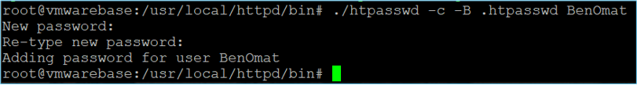
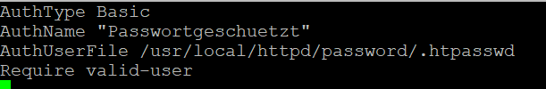
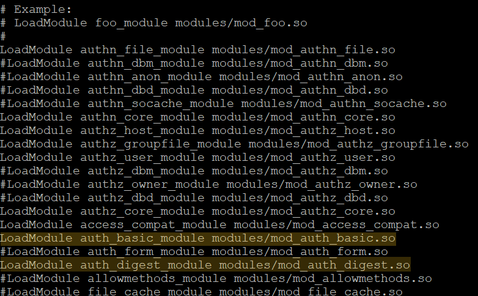
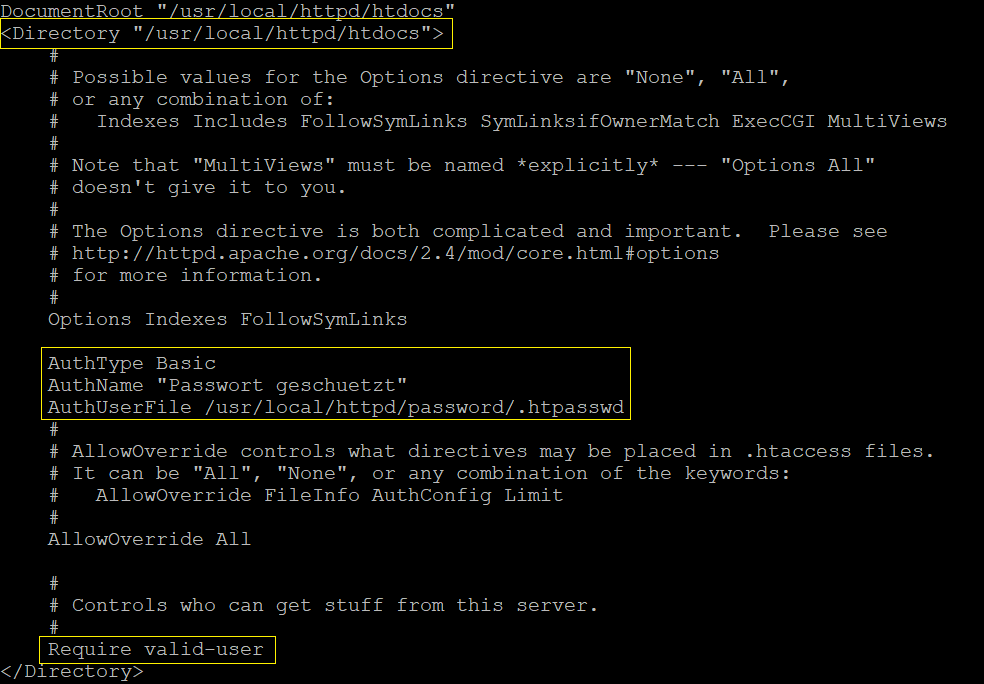
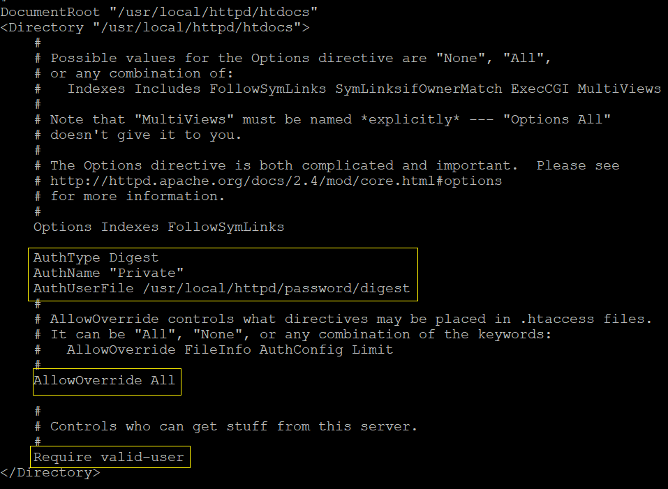

<!-- Inhaltsverzeichnis -->
## Inhaltsverzeichnis
* [Vorbereitungen](#vorbereitungen)
    * [Aufgabenstellung](#aufgabenstellung)
    * [Ablauf](#ablauf)
    * [Software](#software)
* [Theoretische Grundlagen](#theoretische-grundlagen)
    * [Theorie](#theorie)
    * [Begriffserklärung](#begriffserklärung)
* [Setup](#setup)
    * [Installation](#installation)
        * [Apache 2.4.46](#apache-2446)
        * [PERL 5.30.0 ](#perl-5300)
        * [PCRE 8.44](#pcre-844)
        * [APR 1.7.0](#arp-170)
        * [APR-UTIL 1.6.1](#aprutil-161)
        * [EXPAT 2.2.9](#expat-229)
    * [Konfiguration](#konfiguration)
        * [Basic Authentication](#basic-authentication)
        * [Digest Authentication](#digest-authentication)

<!-- Vorbereitungen-->
## Vorbereitungen

### Aufgabenstellung

Dieser in HTTP weit verbereitete Authentifikationsmechanismus gibt einen guten und anschaulichen Überblick über das Funktionsprinzip von Challenge-Response Verfahren. Anhand eines Apache-Webservers, der in die über das VMware-Image bereitgestellte Slackware Distribution einzukompilieren und entsprechend zu konfigurieren ist, sollen beide Mechanismen durch „Ansurfen“ sowie „Sniffen“ des HTTP-Traffic analysiert werden. Die Schwäche der Basic-Authentication ist weiters durch das Abfangen und Dekodieren der Credentials live zu demonstrieren.

### Ablauf
1. Apache-Webserver in Slackware einkompilieren
1. Config files adaptieren
1. Analyse des HTTP-Traffics via Wireshark
1. Live Demonstration der Basic-Authentication Schwäche
### Software
**Folgende Software wird benötigt:**
* Apache
* Wireshark
* SSH-Terminal - Putty (Optional)
* SFTP-Manager - FileZilla (Optional)
* Nano Editor (Optional)
* Vorbereitungen / Software
* Theoretische Grundlagen und Funktionsweise
* Installation
* Konfiguration
## Theoretische Grundlagen

### Theorie
**Basic-Authentication [RFC 2617]**

* Passwort-Benutzername-Tupel wird im Klartext  übermittelt
* Tupelelemente mit „:“ verbunden und Base64 kodiert
* Keine Chiffrierung -> Ohne Zusatzwissen dekodierbar

**Digest-Authentication [RFC 7616]**

* Minderung Sicherheitsrisiko von Basic Authentication
* Challenge-Response-Prinzip
* Keine Übertragung sondern Beweis der Kenntnis von Credentials

### Begriffserklärung
Begriff | Erklärung 
------------ | -------------
Tupel| geordnete Wertesammlungen (eindimensionale Arrays)
RFC(Request for Comments)| Reihe von technischen und organisatorischen Dokumenten
Challenge-Response | Authentifizierungsverfahren auf Basis von Wissen
## Setup

### Installation
#### Apache 2.4.46
* Entpacken
```sh
gunzip -c httpd-2.4.46.tar.gz | tar xvf -
```
* In das Verzeichnis ```/httpd-2.4.46``` wechseln
```sh
cd httpd-2.4.46
```
* Konfigurationspfade festlegen
```sh
./configure --prefix=/usr/local/httpd --with-apr=/usr/local/apr --with-apr-util=/usr/local/apr-util --with-pcre=/usr/local/pcre
```
* Builden und Installieren
```sh
make
make install
```
#### PERL 5.30.0
* Entpacken
```sh
gunzip -c perl-5.30.0.tar.gz | tar xvf - 
```
* In das Verzeichnis ```/perl-5.30.0``` wechseln
```sh
cd perl-5.30.0
```
* Den Konfigurationspfad mittels --prefix festlegen
```sh
./configure --prefix=/usr/local/perl
```
* Builden und installieren
```sh
make
make install
```

#### PCRE 8.44
* Entpacken
```sh
gunzip -c pcre-8.44.tar.gz | tar xvf - 
```
* In das Verzeichnis `/pcre-8.44` wechseln
```sh
cd pcre-8.44
```
* Den Konfigurationspfad mittels --prefix festlegen
```sh
./configure --prefix=/usr/local/pcre
```
* Builden und installieren
```sh
make
make install
```
#### APR 1.7.0
* In das Verzeichnis ```/srclib``` wechseln
```sh
cd httpd-2.4.46/scrclib
```
* Entpacken
```sh
gunzip -c apr-1.7.0.tar.gz | tar xvf -
```
* Verzeichnis umbenennen
> Der Verzeichnisname muss umbenannt werden, da es sonst zu Komplikationen kommt!
```sh
mv apr-1.7.0 apr
```
* In das Verzeichnis wechseln und Pfad konfigurieren
```sh
cd apr
./configure --prefix=/usr/local/apr
```
* Builden und installieren
```sh
make
make install
```

#### APR-UTIL 1.6.1
* In das Verzeichnis ```/srclib``` wechseln
```sh
cd httpd-2.4.46/scrclib
```
* Entpacken
```sh
gunzip -c apr-util-1.6.1.tar.gz | tar xvf -
```
* Verzeichnis umbenennen
> Der Verzeichnisname darf keine Versionsnummer enthalten, da es sonst zu Komplikationen kommt!
```sh
mv apr-util-1.6.1 apr-util
```
* In das Verzeichnis wechseln und Pfad konfigurieren
```sh
cd apr-util
./configure --prefix=/usr/local/apr-util --with-apr=/usr/local/apr

```
* Builden und installieren
```sh
make
make install
```
#### EXPAT 2.2.9
* Entpacken
```sh
gunzip -c expat-2.2.9.tar.gz | tar xvf -
```
* In Das Verzeichnis ```/expat-2.2.9``` wechseln
```sh
cd expat-2.2.9
```
* Konfigurationspfad festlegen
```sh
./configure --prefix=/usr/local/expat
```
* Builden und installieren
```sh
make
make install
```

### Konfiguration
#### Basic Authentication
* ```.htpasswd``` - Datei generieren

Damit sich der User über die Basic-Authentication anmelden kann, wird zuerst ein Benutzer mit dem dazugehörigen Passwort angelegt. Dies geschieht mit dem folgenden Befehl:

```sh
/usr/local/httpd/bin ./htpasswd [options] [Dateiname] [Benutzername]
```
```sh
/usr/local/httpd/bin ./htpasswd -c -B .htpasswd Username
```
Option | Funktion 
------------ | -------------
```-c``` | Erstellen des Passwortfiles. Bei vorhandenem Passwortfile, wird das alte File überschrieben.
```-B```| Verwende Bcrypt Verschlüsselung

Nach der Eingabe der gewünschten Daten, wird zweimal nach dem gewünschten Passwort gefragt:



Nachdem das Passwort File generiert wurde, wird das File an einem gewünschten Ort abgelegt.

>Achtung: Das File auf keinen Fall in den selben Ordner, wo die .htaccess Datei liegen wird.

* ```.htaccess``` - Datei erstellen

Die .htaccess Datei wird verwendet, um die Konfigurationen für den jeweiligen Ordner einzutragen. Hier muss auch der Pfad des .htpasswd Files eingegeben werden, um sich erfolgreich anmelden zu können.



Parameter | Beschreibung
----------|-------------
AuthType | Art der Authentication. In meinem Beispiel Digest und Basic
AuthName | Die Authenticationbezeichnung
AuthUserFile | Pfad, wo die .htpasswd Datei liegt
Require | Zugriffbestimmungen: valid-user = Nur für gültige Nutzer

Das .htaccess File wird in dem zum schützenden Ordner abgelegt. In meinem Fall ist das der htdocs Ordner, der die index.html datei enthält. Das .htaccess File wird für gewöhnlich nicht im FTP Ordner angezeigt.

* ```httpd.conf```-Datei konfigurieren

Als erstes sollten die benötigten Module aktiviert werden. Dazu entfern man die davorstehenden ```#```-Zeichen. 



Nachdem die Module aktiviert worden sind, müssen die Konfigurationsinformationen von der .htaccess Datei genauso in der httpd.conf File aktualisert werden



Der Apache-Server sollte nach jeder Änderung in der Config-File neugestartet werden. Dazu wird der folgende Befehl eingegeben:

```sh
/usr/local/httpd/bin/apachectl restart
```

#### Digest Authentication

* ```.htdigest```- Datei generieren

Um eine Digest Authentication durchzuführen, muss genauso wie bei der Basic Authentication ein User angelegt werden. Diesmal wird der folgende Befehl aufgerufen:

```sh
/usr/local/httpd/bin ./htdigest -c /usr/local/httpd/password/digest "Private" Username
```

```sh
/usr/local/httpd/bin ./htdigest [options] [Pfad] [realm] [Username]
```

Parameter | Funktion
- | -
```c```| Erstellen des Digestfiles
Pfad | Erstellen des Passwortfiles im angegeben Pfad
realm | Die Realm Bezeichnung
Username | Username der angelegt werden soll

Wie bei der Basic Authentication wird jetzt weimal nach einem frei wählbaren Passwort gefragt und nach der Bestätigung das File erstellt.

```httpd.conf```- Datei aktualisieren

Folgende Parameter haben sich im Gegensatz zur Basic Authentication geändert:

Parameter|Änderung
-|-
AuthType| Von Basic auf Digest
AuthName| AuthName wurde verändert
AuthUserFile|Verlinkt jetzt auf die generierte Digest-Datei.



Der Apache-Server sollte nach jeder Änderung in der Config-File neugestartet werden. Dazu wird der folgende Befehl eingegeben:

````sh
/usr/local/httpd/bin/apachectl restart
````

